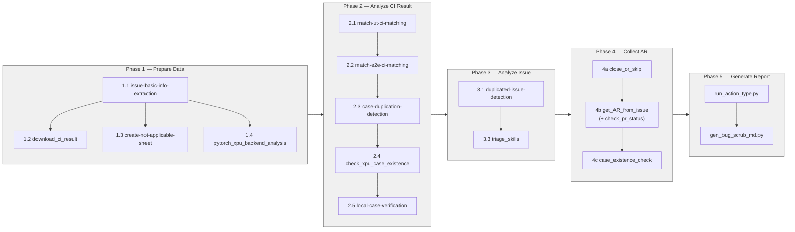
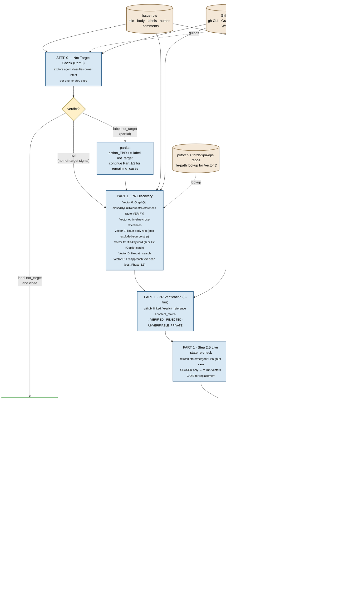

# Bug Scrub Workflow Diagram

> **Path convention**: `${PYTORCH_REPO_ROOT}` (default `~/upstream/pytorch`) — see [`SKILL.md`](./SKILL.md) for the full convention.

Visual reference for the 5-phase torch-xpu-ops bug-scrub pipeline, showing how
each skill consumes and produces data in the shared Excel workbook
(`result/torch_xpu_ops_issues.xlsx`) and supporting artifact folders.

Source of truth for phase semantics: [`SKILL.md`](./SKILL.md) (v3.3).

---

## 1. End-to-End Pipeline

```mermaid
flowchart TD
    %% ========== EXTERNAL INPUTS ==========
    GH[(GitHub API<br/>intel/torch-xpu-ops)]:::ext
    CI[(CI artifacts<br/>torch-xpu-ops + stock pytorch)]:::ext
    PT[(pytorch/pytorch repo)]:::ext

    %% ========== PHASE 1: PREPARE DATA ==========
    subgraph P1["Phase 1 — Prepare Data"]
        direction TB
        S11["1.1 issue-basic-info-extraction<br/><i>fetch + parse issues</i>"]:::skill
        S12["1.2 download_ci_result<br/><i>download CI artifacts</i>"]:::skill
        S13["1.3 create-not-applicable-sheet<br/><i>wontfix / not_target filter</i>"]:::skill
        S14["1.4 pytorch_xpu_backend_analysis<br/><i>operator impl deep-dive</i>"]:::skill
    end

    %% ========== PHASE 2: ANALYZE CI RESULT ==========
    subgraph P2["Phase 2 — Analyze CI Result"]
        direction TB
        S21["2.1 match-ut-ci-matching"]:::skill
        S22["2.2 match-e2e-ci-matching"]:::skill
        S23["2.3 case-duplication-detection"]:::skill
        S24["2.4 check_xpu_case_existence<br/><i>explore-assisted deep analysis;<br/>first blank case per issue</i>"]:::skill
        S25["2.5 local-case-verification<br/><i>local pytest / reproducer for<br/>issues with no CI coverage</i>"]:::skill
    end

    %% ========== PHASE 3: ANALYZE ISSUE ==========
    subgraph P3["Phase 3 — Analyze Issue"]
        direction TB
        S31["3.1 duplicated-issue-detection"]:::skill
        S33["3.3 triage_skills<br/><i>one-by-one deep triage<br/>(see §5 sub-workflow)</i>"]:::skill
    end

    %% ========== PHASE 4: COLLECT AR ==========
    subgraph P4["Phase 4 — Collect AR"]
        direction TB
        S4a["4a close_or_skip<br/><i>RULE 1: Fixed → Close<br/>RULE 2: not_target/wontfix → Skip</i>"]:::skill
        S4b["4b get_AR_from_issue<br/>(+ check_pr_status)<br/><i>(see §6 sub-workflow)</i>"]:::skill
        S4c["4c case_existence_check"]:::skill
    end

    %% ========== PHASE 5: GENERATE REPORT ==========
    subgraph P5["Phase 5 — Generate Report"]
        direction TB
        S51["run_action_type.py<br/><i>classify action_TBD → action_Type</i>"]:::script
        S52["gen_bug_scrub_md.py<br/><i>render markdown</i>"]:::script
    end

    %% ========== PHASE 5b: GENERATE HTML (optional) ==========
    subgraph P5B["Phase 5b — Generate HTML Report (on demand)"]
        direction TB
        S5B1["gen_bug_scrub_html.py<br/><i>re-runs gen_bug_scrub_md.py<br/>then md → interactive HTML</i>"]:::script
    end

    %% ========== ARTIFACTS ==========
    XLSX[(result/torch_xpu_ops_issues.xlsx<br/>Issues · Test Cases · E2E · Others · Not Applicable)]:::art
    CIART[(ci_results/)]:::art
    BACK[(pytorch_xpu_backend_analysis.md<br/><i>narrative architecture</i>)]:::art
    OPLIST[(xpu_supported_operators_complete_list.md<br/><i>operator -> dependency registry</i>)]:::art
    REPORT[(result/bug_scrub.md<br/>result/bug_scrub_ut.md<br/>result/details/{id}.md × N)]:::out
    HTML[(result/bug_scrub.html<br/><i>self-contained, on demand</i>)]:::out

    %% ========== FLOWS ==========
    GH --> S11
    CI --> S12
    PT --> S14

    S11 -->|"Issues · Test Cases · E2E · Others sheets<br/>+ PyTorchXPU Status/Estimate/Depending/Short Comments"| XLSX
    S12 --> CIART
    S13 -->|"+ Not Applicable sheet"| XLSX
    S14 --> BACK
    S14 --> OPLIST

    XLSX --> S21
    CIART --> S21
    S21 -->|"+ XPU Status · Stock Status"| XLSX

    XLSX --> S22
    CIART --> S22
    S22 -->|"+ E2E statuses"| XLSX

    XLSX --> S23
    S23 -->|"+ duplicate_group_id"| XLSX

    XLSX --> S24
    S24 -->|"+ xpu_case_existence<br/>+ case_existence_comments"| XLSX

    XLSX --> S25
    S25 -->|"+ Local status<br/>+ Local status comments<br/><i>(Issues sheet only)</i>"| XLSX

    XLSX --> S31
    S31 -->|"+ duplicated_issue"| XLSX

    XLSX --> S33
    BACK -.reference.-> S33
    OPLIST -.operator -> dependency lookup.-> S33
    S33 -->|"+ Category · Priority<br/>+ Dependency<br/>+ Root Cause · Fix Approach"| XLSX

    XLSX --> S4a
    S4a -->|"+ action_TBD (close/skip)<br/>+ action_reason<br/>+ owner_transferred"| XLSX

    XLSX --> S4b
    GH -.PR status.-> S4b
    S4b -->|"append action_TBD<br/>append action_reason<br/>append owner_transferred"| XLSX

    XLSX --> S4c
    S4c -->|"append 'check_case_avaliablity'<br/>append case_existence_comments"| XLSX

    XLSX --> S51
    S51 -->|"+ action_Type (17-leaf taxonomy)"| XLSX

    XLSX --> S52
    S52 --> REPORT

    REPORT --> S5B1
    XLSX --> S5B1
    S5B1 --> HTML

    %% ========== STYLES ==========
    classDef ext fill:#f4e8d8,stroke:#8b6f47,stroke-width:2px,color:#000
    classDef skill fill:#d8e8f4,stroke:#2c5f8a,stroke-width:1px,color:#000
    classDef script fill:#e8d8f4,stroke:#5a2c8a,stroke-width:1px,color:#000
    classDef art fill:#fff4d8,stroke:#8a7c2c,stroke-width:1px,color:#000
    classDef out fill:#d8f4d8,stroke:#2c8a2c,stroke-width:2px,color:#000
```

**Legend**

| Shape / Color | Meaning |
|---|---|
| 🟤 Cylinder (tan) | External data source (GitHub API, CI system, pytorch repo) |
| 🟦 Rectangle (blue) | Skill (LLM-driven, `SKILL.md`-governed) |
| 🟪 Rectangle (purple) | Deterministic Python script |
| 🟨 Cylinder (yellow) | Intermediate artifact (Excel, CI dumps, analysis doc) |
| 🟩 Cylinder (green) | Final deliverable (markdown report) |
| Solid arrow | Read / write |
| Dashed arrow (`-.label.->`) | Referenced only (no mutation) |
| Edge label | Column(s) added or data passed |

---

## 2. Skill → Column Matrix

Each skill's contract, in the order the columns appear in the Excel:

| Phase | Skill | Reads | Writes (Issues sheet) | Writes (Test Cases sheet) |
|---|---|---|---|---|
| 1.1 | issue-basic-info-extraction | GitHub API + PyTorchXPU Project (GraphQL) | Issue ID, Title, Status, Assignee, Reporter, Labels, Created Time, Body, Priority, **PyTorchXPU Status**, **PyTorchXPU Estimate**, **PyTorchXPU Depending**, **PyTorchXPU Short Comments**; also writes **Others** sheet (issues with no UT/E2E case) | Test Case, Test File, Error Message, Traceback |
| 1.2 | download_ci_result | CI artifacts URL | — (produces `ci_results/`) | — |
| 1.3 | create-not-applicable-sheet | Issue labels | *(writes "Not Applicable" sheet)* | — |
| 1.4 | pytorch_xpu_backend_analysis | pytorch + torch-xpu-ops repos | — (static resources: `result/pytorch_xpu_backend_analysis.md` narrative and bundled `prepare_data/pytorch_xpu_backend_analysis/xpu_supported_operators_complete_list.md` operator → dependency registry; both consumed by Phase 3.3) | — |
| 2.1 | match-ut-ci-matching | Test Cases, CI artifacts | — | XPU Status, Stock Status |
| 2.2 | match-e2e-ci-matching | E2E Test Cases, CI artifacts | — | *(E2E sheet)* XPU Status, Stock Status |
| 2.3 | case-duplication-detection | Test Cases | — | duplicate_group_id |
| 2.4 | check_xpu_case_existence | Test Cases (first blank row per issue; explore-assisted deep analysis) | — | xpu_case_existence, case_existence_comments |
| 2.5 | local-case-verification | Issues with all-blank CI status on Test Cases / E2E Test Cases; **non-performance** Others rows after deep issue-body repro extraction; performance Others are skipped | **Local status**, **Local status comments** | — |
| 3.1 | duplicated-issue-detection | Issues, Test Cases | duplicated_issue | — |
| 3.3 | triage_skills | Issues body, Test Cases, pytorch_xpu_backend_analysis | Category, Priority, Dependency, Root Cause, Fix Approach | — |
| 4a | close_or_skip | Labels, Test Cases statuses | action_TBD, action_reason, owner_transferred | — |
| 4b | get_AR_from_issue | Issues body, GitHub PRs (gh api) | action_TBD *(append)*, action_reason *(append)*, owner_transferred *(append)* | — |
| 4c | case_existence_check | xpu_case_existence, case_existence_comments | action_TBD *(append `check_case_avaliablity`)*, action_reason *(append)* | — |
| 5 (script) | `run_action_type.py` | action_TBD | action_Type *(17-leaf taxonomy, `+`-joined)* | — |
| 5 (script) | `gen_bug_scrub_md.py` | Issues sheet | — (produces `bug_scrub.md`, `bug_scrub_ut.md`, `details/*.md`) | — |

---

## 3. Execution Order & Dependencies



**Invariants**

- Phases are strictly sequential; later phases append columns to the shared Excel.
- Within a phase, sub-steps labeled N.1 → N.2 → N.3 → N.4 are also strictly sequential.
- Phase 4 sub-steps 4a → 4b → 4c are sequential because each may **append** to `action_TBD` / `action_reason`.
- Phase 5 is purely presentational: it classifies and renders, never rewrites verdict columns. PR-state correctness is owned by Phase 4b.

---

## 4. Output Artifacts

```
result/
├── torch_xpu_ops_issues.xlsx          ← single source of truth, grown phase-by-phase
├── torch_xpu_ops_issues_bk_*.xlsx     ← step-by-step backups (convention)
├── pytorch_xpu_backend_analysis.md    ← from 1.4 (narrative; Phase 3.3 reference)
├── bug_scrub.md                       ← from 5, full scope (all issues)
├── bug_scrub_ut.md                    ← from 5, UT-scoped subset
└── details/
    └── {issue_id}.md × N              ← from 5, one per issue
.opencode/skills/bug_scrub/prepare_data/pytorch_xpu_backend_analysis/
└── xpu_supported_operators_complete_list.md  ← from 1.4 (operator → dependency registry, Phase 3.3 lookup)
ci_results/                            ← from 1.2, per-run artifacts
local_logs/                            ← from 2.5, one log per locally-run issue (pytest / reproducer stdout+stderr)
```

---

## 5. Triage Skills Sub-Workflow (Phase 3.3 expansion)

`triage_skills` runs once per issue (no batch script — strictly one-by-one
unless using the wave-based parallel pattern in
[`SKILL_Batch_Orchestration.md`](./analyze_issue/triage_skills/SKILL_Batch_Orchestration.md)).
The diagram below shows the **three core analysis steps** (3, 5, 6) that
produce the canonical JSON output. Steps 1 (version detection), 2 (reproduce
extraction), and 4 (runtime verification) are diagnostic prerequisites
documented in [`triage_skills/SKILL.md`](./analyze_issue/triage_skills/SKILL.md)
and are omitted here for clarity.

```mermaid
flowchart TD
    %% ========== INPUTS ==========
    IN_ISSUE[(Issue row<br/>title · body · labels · comments)]:::inp
    IN_OP[(xpu_supported_operators_complete_list.md<br/>operator → dependency)]:::inp
    IN_SRC[(${PYTORCH_REPO_ROOT} + third_party/torch-xpu-ops<br/>source + tests)]:::inp
    IN_CI[(ci_results/.../op_ut/*.xml<br/>UT logs)]:::inp
    IN_BACK[(pytorch_xpu_backend_analysis.md)]:::inp

    %% ========== STEPS ==========
    T3["STEP 3<br/>Code Exploration + Test Analysis<br/><sub>explore agent (medium depth)<br/>locate impl + test files<br/>read assertions / kernel launch</sub>"]:::step
    T5["STEP 5<br/>Deep Root Cause Analysis<br/><sub>XPU vs CPU fallback diff<br/>kernel-code investigation<br/>error-pattern → cause mapping</sub>"]:::step
    T6["STEP 6<br/>Dependency Analysis + Classification<br/><sub>apply 4 taxonomies:<br/>Category · Priority · Dependency · Root Cause</sub>"]:::step

    %% ========== HELPER SKILLS ==========
    H_CAT["SKILL_Category_Analysis.md<br/><sub>11-bucket rubric</sub>"]:::help
    H_PRI["SKILL_Priority_Analysis.md<br/><sub>P0–P3 weighted scoring</sub>"]:::help
    H_DEP["SKILL_Domain_Patterns.md<br/><sub>quick-reference patterns</sub>"]:::help
    H_DEEP["SKILL_Deep_Analysis_Patterns.md<br/><sub>error-type → investigation</sub>"]:::help

    %% ========== OUTPUT ==========
    OUT["JSON entry per issue<br/><b>{ row, issue_id, category, priority,<br/>dependency, root_cause, fix_approach }</b>"]:::out

    POST["run_needs_owner_fix.py<br/><sub>repair: NEEDS_OWNER + has Assignee → ROOT_CAUSE</sub>"]:::script
    XLSX[(result/torch_xpu_ops_issues.xlsx<br/>Issues sheet)]:::art

    %% ========== FLOW ==========
    IN_ISSUE --> T3
    IN_SRC --> T3
    T3 --> T5
    IN_CI -.evidence.-> T5
    IN_BACK -.reference.-> T5
    T5 --> T6
    IN_OP -.lookup.-> T6

    H_DEP -.guides.-> T3
    H_DEEP -.guides.-> T5
    H_CAT -.guides.-> T6
    H_PRI -.guides.-> T6

    T6 --> OUT
    OUT --> XLSX
    XLSX --> POST
    POST --> XLSX

    %% ========== STYLES ==========
    classDef inp fill:#f4e8d8,stroke:#8b6f47,stroke-width:2px,color:#000
    classDef step fill:#d8e8f4,stroke:#2c5f8a,stroke-width:2px,color:#000
    classDef help fill:#e8e8f4,stroke:#5a5a8a,stroke-width:1px,color:#000,stroke-dasharray: 3 3
    classDef out fill:#d8f4d8,stroke:#2c8a2c,stroke-width:2px,color:#000
    classDef art fill:#fff4d8,stroke:#8a7c2c,stroke-width:1px,color:#000
    classDef script fill:#e8d8f4,stroke:#5a2c8a,stroke-width:1px,color:#000
```

### 5.1 Helper-Skill Files (governance, not executed directly)

The dashed nodes above are reference documents that the LLM consults while
performing each step. They live in `analyze_issue/triage_skills/`:

| File | Role |
|---|---|
| [`SKILL.md`](./analyze_issue/triage_skills/SKILL.md) | Authoritative output schema + 4 taxonomies |
| [`SKILL_Triage_Logic.md`](./analyze_issue/triage_skills/SKILL_Triage_Logic.md) | Orchestration of the 6 steps |
| [`SKILL_Category_Analysis.md`](./analyze_issue/triage_skills/SKILL_Category_Analysis.md) | 11-category rubric (Distributed > Flash Attention > Inductor > TorchAO > Sparse > Torch Ops - gemm/eltwise/reduction/others > Torch Runtime > Others) |
| [`SKILL_Priority_Analysis.md`](./analyze_issue/triage_skills/SKILL_Priority_Analysis.md) | P0–P3 weighted scoring |
| [`SKILL_Domain_Patterns.md`](./analyze_issue/triage_skills/SKILL_Domain_Patterns.md) | Dependency taxonomy (driver, xccl, triton, oneDNN, oneMKL, oneAPI, CPU fallback, SYCL kernel:&lt;file&gt;, upstream-pytorch, blank) + quick-reference patterns + tools |
| [`SKILL_Deep_Analysis_Patterns.md`](./analyze_issue/triage_skills/SKILL_Deep_Analysis_Patterns.md) | Error-pattern → investigation mapping |
| [`SKILL_E2E_Benchmark.md`](./analyze_issue/triage_skills/SKILL_E2E_Benchmark.md) | E2E/benchmark-specific triage |
| [`SKILL_Batch_Orchestration.md`](./analyze_issue/triage_skills/SKILL_Batch_Orchestration.md) | Wave-based parallel pattern (5 issues × 5 explore agents × N waves) for large-scale runs |

### 5.2 Step → Column Mapping

| Step | Produces | Excel column populated |
|---|---|---|
| 1 | version table | (none — diagnostic only) |
| 2 | reproduce command | (none — used by step 4) |
| 3 | impl + test paths | feeds Root Cause text |
| 4 | runtime PASS / FAIL evidence | feeds Root Cause + Priority |
| 5 | root-cause narrative + file:line citations | **Root Cause** |
| 6 | classified JSON | **Category**, **Priority**, **Dependency**, **Fix Approach** |
| post | NEEDS_OWNER repair | **action_Type** correction |

### 5.3 Invariants

- Steps 1–6 are strictly sequential per issue (later steps depend on earlier evidence).
- Step 4 (runtime verification) is **skipped** if the issue's reported PyTorch / driver / Triton version is incompatible with the local conda env — the version table from Step 1 gates this.
- The output JSON object **must** match the schema in [`SKILL.md`](./analyze_issue/triage_skills/SKILL.md): no markdown fences, no wrapper key, one object per issue.
- `run_needs_owner_fix.py` runs **once after the full Phase-3 pass**, not per-issue.

---

## 6. get_AR_from_issue Sub-Workflow (Phase 4b expansion)

`get_AR_from_issue` runs once per non-skipped issue after `4a close_or_skip`.
It produces the action-required (AR) signal that drives `action_TBD`,
`action_reason`, and `owner_transferred`. The skill is composed of three
parts that execute as **Step 0 → Part 1 → Part 2** (Part 3 in the SKILL.md
text runs **first** at runtime as the not-target gate):



### 6.1 Part Roles

| Part | Runtime order | Role |
|---|---|---|
| Part 3 — Not-Target Check | **Step 0** (runs first) | Owner-issued won't-fix / out-of-scope detection. Explore-agent driven, no pattern matching. |
| Part 1 — PR Discovery + Verification + Status | After Step 0 (unless full short-circuit) | Find candidate PRs (5 vectors), verify each (3-tier), then run `check_pr_status` 4-gate analysis. |
| Part 2 — Comment AR | Parallel with Part 1 | Explore-agent classification of unresolved comment requests by author association, request type, and blocking level. |

### 6.2 Output Columns

| Column | Source | Notes |
|---|---|---|
| `action_TBD` | Part 3 (short-circuit) or combined Part 1/2 | Appended to any value left by 4a `close_or_skip`. |
| `action_reason` | All parts | Free-form rationale, multi-source merged. |
| `owner_transferred` | Earliest binding owner from Part 3, else PR author from Part 1, else commenter from Part 2 | Single value — first binding owner wins. |

### 6.3 Invariants

- Step 0 (Part 3) **always runs first**; on `label not_target and close` it short-circuits Parts 1/2.
- Part 1 verification is **mandatory** — no candidate PR is treated as a fix without a verdict.
- Vector 0 (GraphQL `closedByPullRequestsReferences`) auto-verifies; Vectors A–E still run for completeness (catches follow-up fixes, Copilot PRs, and PRs named only in the Fix Approach).
- Step 2.5 (live PR-state re-check) is **mandatory** before any verdict verb is emitted; it prevents stale-snapshot mis-verdicts (e.g., a now-merged PR being reported as CLOSED). For CLOSED-only verified sets, the replacement-PR search re-runs Vectors C/D/E before falling through to RETRIAGE_PRS.
- Inner-source / private-repo PRs cannot be verified via public API → flagged `UNVERIFIABLE_PRIVATE`, treated as informational.
- `run_phase4b_merge.py` runs **once after the full Phase-4b pass**, not per-issue. The agent emits `action_TBD`/`action_reason`/`action_Type` directly via the **DERIVATION RULE** during deep analysis (§6.4); no post-pass backfill script is needed.

---

## Version

v2.1 — 2026-05-23 — Collapsed TRACK_PR action_Type into LAND_PR. Phase 4b agent now emits `"Land PR <ref>"` for ALL OPEN VERIFIED `fixes`/`supersedes` PRs (regardless of CI state); gate verbs (`Address CI failures on PR <ref>` / `Resolve unresolved review comments on PR <ref>`) are still emitted in parallel when applicable. PR-state downgrade matrix R3 row (OPEN+red/pending CI) updated accordingly. Classifier `run_action_type.py` renamed bucket `TRACK_PR → LAND_PR` and dropped legacy `track .* to merge` regex variants. Spec edits in: `analyze_issue/get_AR_from_issue/{AGENT_INSTRUCTIONS.md, SKILL.md}`, `bug_scrub/SKILL.md`, `collect_AR/case_existence_check/SKILL.md`, `examples/phase4b_real_example.md`. Note: the v1.6 entry below still references `TRACK_PR` verbatim as historical record — that text is intentionally preserved.

v2.0 — 2026-05-21 — §1 master diagram, §2 Skill→Column Matrix, and §4 Output Artifacts updated to reflect Phase 1.4 reframed as a static-resource carrier: `xpu_supported_operators_complete_list.md` now lives as a bundled resource at `.opencode/skills/bug_scrub/prepare_data/pytorch_xpu_backend_analysis/`, while `pytorch_xpu_backend_analysis.md` remains in `result/` as the narrative reference. Routine Phase 1 runs do not regenerate them; downstream Phase 3.3 readers use these static paths.

v1.9 — 2026-05-17 — Added Phase 2.5 `local-case-verification` to §1 master diagram (new node `S25`, new write-edge `Local status`/`Local status comments` to xlsx), §2 Skill→Column Matrix (new row covering Issues with all-blank CI status on Test Cases / E2E Test Cases, plus all Others rows), §3 dependency chain (`2.4 → 2.5`), and §4 Output Artifacts (`local_logs/` per-issue log directory). 2.5 writes a single aggregated `Local status` column on the Issues sheet — it never modifies per-row CI status columns. Downstream phases (3.3, 4a) treat `Local status` as authoritative only for PVC + Linux issues.

v1.8 — 2026-05-17 — §1 master diagram, §2 Skill→Column Matrix, and §4 Output Artifacts updated to expose Phase 1.4's second output `xpu_supported_operators_complete_list.md` (operator → dependency registry, 749 ops). Phase 3.3 now shows an explicit dashed "operator → dependency lookup" edge from this registry into `triage_skills`, matching how `SKILL_Triage_Logic.md::get_operator_dependencies()` actually consumes it. Phase 3 does NOT depend on Phase 2 for dependency classification — Phase 2 only contributes CI pass/fail evidence used in Step 5 (root cause), not in Step 6 (dependency).
v1.7 — 2026-05-14 — §1 master diagram + §2 Skill→Column Matrix updated for Phase 1.1: now extracts all 5 PyTorchXPU project fields (Priority, Status, Estimate, Depending, Short Comments) in a single GraphQL call per issue and writes the four non-Priority fields to Issues cols 16-19. Added new "Others" sheet to the Excel artifact node (issues with no parseable UT or E2E reproducer).
v1.6 — 2026-04-29 — Retired `run_pass_backfill.py` post-pass node from §6 sub-workflow. Its classification rule (VERIFIED+MERGED→VERIFY_AND_CLOSE / +OPEN→TRACK_PR / +CLOSED-unmerged→RETRIAGE_PRS) was inlined into the Phase 4b agent prompt as the **DERIVATION RULE** (`agent_space/phase4b/AGENT_INSTRUCTIONS.md`), so verdicts are emitted during deep analysis rather than patched after merge.
v1.5 — 2026-04-27 — Added Phase 5b (`generate_html_report`) node to §1 master diagram: `gen_bug_scrub_html.py` consumes `bug_scrub.md` + `Issues` sheet (for Category/Dependency backfill) and emits self-contained `bug_scrub.html`. Phase 5 markdown remains canonical and unchanged.
v1.4 — 2026-04-27 — Reverted Phase 5 reconciliation node added in v1.3. PR-state fixes belong in Phase 4b only (Vector E + Step 2.5 in §6 sub-workflow remain). Phase 5 is purely presentational: `run_action_type.py` → `gen_bug_scrub_md.py`.
v1.3 — 2026-04-27 — Phase 4b: added Vector E (Fix-Approach text scan) and Step 2.5 (live PR-state re-check + replacement-PR search) to §6 sub-workflow; Phase 5: inserted `run_fix_approach_reconcile.py` between `run_action_type.py` and `gen_bug_scrub_md.py` in §1, §2, §3.
v1.2 — 2026-04-22 — added §6 get_AR_from_issue sub-workflow (Step 0 → Part 1 → Part 2, with 5-vector PR discovery, 3-tier verification, 4-gate check_pr_status, and merge/backfill scripts); trimmed §5 to the 3 core analysis steps (3, 5, 6); cross-referenced §6 from the §1 master diagram.
v1.1 — 2026-04-22 — added §5 Triage Skills sub-workflow (6-step expansion of Phase 3.3) with helper-skill reference matrix.
v1.0 — 2026-04-22 — initial workflow diagram accompanying bug_scrub SKILL.md v3.3.
